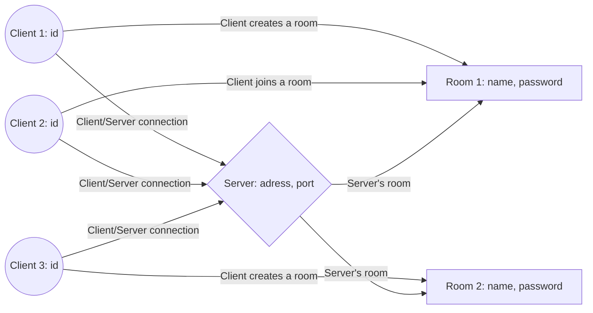

# websocket-chat-server

A node.js software that allow clients communicate using WebSockets.

# Require

Refer to the "websocket-chat-client" repository (https://github.com/vavarm/websocket-chat-client) as an example of client.

# Includes

npm modules:
|Name            |Description                                 |Link                                     |
|----------------|--------------------------------------------|-----------------------------------------|
|ws              |WebSocket Library                           |https://www.npmjs.com/package/ws         |
|uuid-random     |Random and unique identifier for each client|https://www.npmjs.com/package/uuid-random|
|chalk           |Syntax highlighting in terminal             |https://www.npmjs.com/package/chalk      |

# Graph

